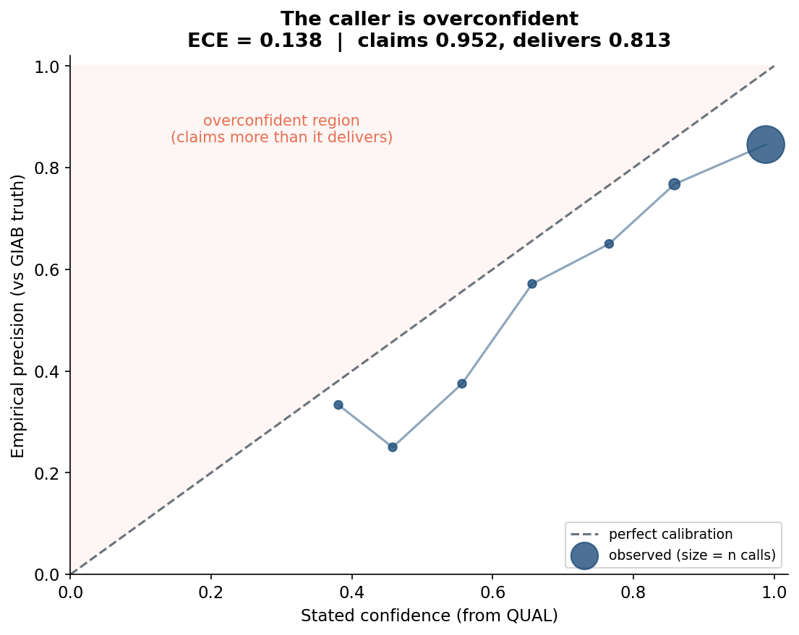
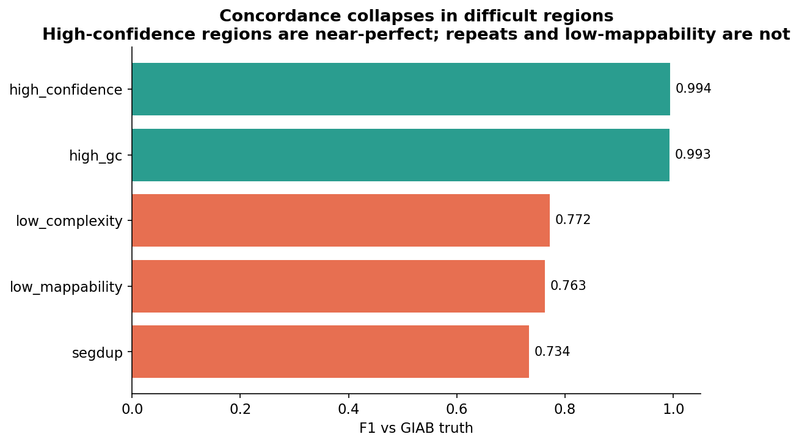
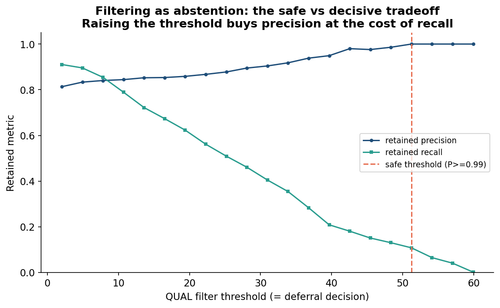
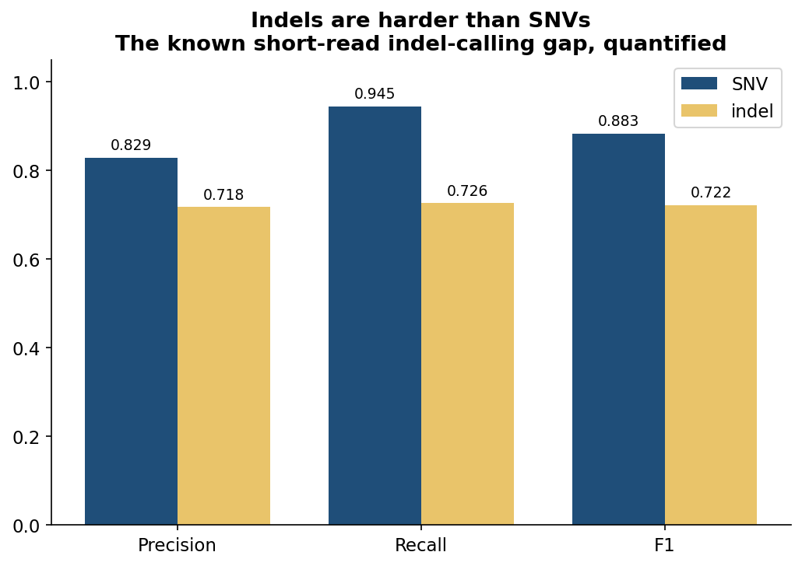

# variant-calling-calibration-benchmark

> **A benchmark that asks not just whether a variant caller is accurate, but whether its confidence is honest. It scores calls against the GIAB truth set, stratifies performance by genomic difficulty, measures whether the caller's QUAL scores are calibrated, and treats quality filtering as an abstention decision with a safe-versus-decisive tradeoff.**

[](https://github.com/gbadedata/variant-calling-calibration-benchmark/actions/workflows/ci.yml)
[](https://www.python.org/downloads/)
[](#testing)
[](LICENSE)

Most variant-calling benchmarks report a single F1 against a truth set and stop. That number hides the two things a deployment decision actually depends on: where the caller fails, and whether you can trust the confidence score it attaches to each call. This framework measures both.

It is the companion to a [clinical variant-interpretation benchmark](https://github.com/gbadedata/clinvar-interpretation-benchmark) that applies the same evaluation philosophy, oracle ground truth, stratification, calibration, and abstention, to LLM output. Here the same discipline is turned on a variant caller's confidence scores. One coherent way of thinking about trust, applied to two very different kinds of model.

> **A note on the numbers in this README, stated plainly.** The framework is the deliverable. The headline numbers shown below and in the figures come from a **synthetic caller** built with a deliberately realistic miscalibration, so every evaluation layer has a known signal to detect and the whole thing runs and is tested offline. This is a design choice, not a shortcut: it lets the evaluator be validated against ground truth it controls. Running the framework on a real caller's VCF against GIAB is one command (see [Running on real GIAB data](#running-on-real-giab-data)); the conclusions there are the scientific output. Where a number is synthetic, this README says so.

---

## What it finds (on the synthetic caller)

Run against the bundled synthetic caller, the framework produces this in one command. Every figure below is generated from this run.

| Question | Layer | Result |
|---|---|---|
| How accurate? | Concordance | F1 0.86 overall; SNV 0.90, indel 0.77 |
| Where does it fail? | Stratification | F1 0.99 in high-confidence regions, 0.77–0.80 in repeats / low-mappability |
| Is its confidence honest? | Calibration | **Expected Calibration Error 0.14, verdict OVERCONFIDENT** (claims 0.95, delivers 0.81) |
| Where to stop trusting it? | Filtering | Best F1 at QUAL≥5; reaching 99% precision needs QUAL≥90 (most calls discarded) |

The point is not these specific synthetic numbers. It is that the framework surfaces, separately and quantitatively, the four things a deployment decision actually needs, and that on a real caller it would surface the real equivalents. The calibration layer in particular catches a failure a plain F1 cannot see: a caller can look accurate overall while systematically overstating its confidence in exactly the regions where the genome is hardest.

---

---

## Table of contents

- [What it finds](#what-it-finds-on-the-synthetic-caller)
- [The four questions](#the-four-questions)
- [Why calibration, not just accuracy](#why-calibration-not-just-accuracy)
- [Figures](#figures)
- [The oracle](#the-oracle-giab)
- [The four evaluation layers](#the-four-evaluation-layers)
- [Interpreting the results](#interpreting-the-results)
- [How this was built](#a-note-on-how-this-was-built)
- [Quick start](#quick-start)
- [Running on real GIAB data](#running-on-real-giab-data)
- [Architecture](#architecture)
- [How the evaluator is validated](#how-the-evaluator-is-validated)
- [Limitations](#limitations)
- [Testing](#testing)
- [References](#references)

---

## The four questions

1. **How accurate is the caller?** Precision, recall, F1 against GIAB truth, split by SNV and indel.
2. **Where does it fail?** Concordance stratified by genomic difficulty (high-confidence, low-complexity, segmental duplication, GC extremes, low mappability).
3. **Is its confidence honest?** Whether the caller's QUAL scores are calibrated: when it claims 99% confidence, is it right 99% of the time? Summarised by Expected Calibration Error.
4. **Where should it stop trusting itself?** Quality filtering reframed as an abstention decision, with the threshold that keeps retained calls safe without discarding too many true positives.

---

## Why calibration, not just accuracy

A variant caller attaches a QUAL score to every call: a phred-scaled probability that the call is correct. Downstream pipelines filter on that score, trusting that QUAL means what it says. But a caller can have a respectable overall F1 and still be badly miscalibrated, systematically overconfident in difficult regions, for example. If QUAL overstates true precision, every threshold built on it is wrong, and the errors concentrate exactly where the genome is hardest.

Calibration is the missing measurement. It puts the caller's confidence on the same footing as any probabilistic classifier and asks whether that confidence is honest. This is the same question that matters for an LLM that outputs a confidence, which is why the framework mirrors the abstention-and-calibration design of its clinical-interpretation companion.

---

## Figures

### Is the confidence honest?
Each point is a QUAL-confidence bin: stated confidence on the x-axis, empirical precision (vs GIAB) on the y-axis. Points below the diagonal are overconfident. The caller here consistently claims more than it delivers, summarised by an Expected Calibration Error of 0.14.



### Where does it fail?
Concordance is near-perfect in high-confidence regions and collapses in repetitive and low-mappability regions. A single genome-wide F1 would have hidden this entirely.



### Filtering as abstention
Raising the QUAL filter threshold is a deferral decision: it buys precision by discarding low-confidence calls, at the cost of recall. The safe threshold is the point where retained calls reach a target precision.



### Indels are harder than SNVs
The well-known short-read indel-calling gap, quantified by the benchmark.



---

## The oracle: GIAB

The ground truth is the Genome in a Bottle benchmark set for HG001 (NA12878), v4.2.1, the community-standard truth set for validating small-variant calls, developed by NIST and the GA4GH Benchmarking Team. Concordance is stratified using GIAB's own stratification BED files, which partition the genome into difficulty categories (low-complexity, segmental duplications, GC content, mappability). Using GIAB's truth set and GIAB's stratifications means the evaluation is defensible and reproducible against a resource the field already trusts.

---

## The four evaluation layers

### Layer 1 — Concordance
Each call is classified TP / FP / FN against the truth set. Precision, recall, and F1 are computed overall and split by variant type. (`src/benchmark/concordance.py`)

### Layer 2 — Stratification
The same concordance, broken down by genomic-difficulty region and by QUAL bin. This locates failure rather than averaging over it. (`src/benchmark/stratify.py`)

### Layer 3 — Calibration
Calls are binned by QUAL-implied confidence. For each bin, mean stated confidence is compared to empirical precision, and the support-weighted mean absolute gap is the Expected Calibration Error (ECE). ECE = 0 is perfect honesty; larger means more miscalibration. The overall sign of the gap gives an overconfident / underconfident / well-calibrated verdict. (`src/benchmark/calibration.py`)

### Layer 4 — Filtering as abstention
A QUAL filter is a deferral decision: calls below the threshold are ones the caller declines to commit to. The framework sweeps thresholds and reports retained precision, recall, and F1 at each, then identifies the threshold maximising F1 and the lowest threshold reaching a target precision (the safe operating point). This is the same safe-versus-decisive analysis the clinical-interpretation companion applies to an LLM's abstentions. (`src/benchmark/filtering.py`)

---

## Interpreting the results

The four layers are designed to be read together, because each one reframes the others.

**Overall F1 is the least informative number here.** On the synthetic caller it is 0.86, which sounds adequate. The stratification layer immediately shows why that single number is misleading: performance is near-perfect (F1 0.99) in high-confidence regions and collapses to 0.77–0.80 in repeats, segmental duplications, and low-mappability regions. A caller deployed on a clinically relevant gene that happens to sit in a difficult region would be far less reliable than its headline F1 implies. Averaging hides exactly the cases that matter most.

**The calibration result is the one with teeth.** An Expected Calibration Error of 0.14 with a positive gap means the caller's QUAL scores systematically claim more confidence than the calls deserve: it asserts a mean confidence of 0.95 while delivering empirical precision of 0.81. This matters because every downstream filter trusts QUAL. If QUAL is inflated, a lab that filters at "QUAL ≥ 30, surely safe" is unknowingly keeping false positives, and the error concentrates in difficult regions where the inflation is worst. A plain concordance benchmark would never reveal this; only putting stated confidence next to empirical precision does.

**The filtering layer turns that into an operational number.** If you require 99% precision in retained calls, the safe threshold sits extremely high (QUAL ≥ 90 on the synthetic caller), which discards most calls. That is the safe-versus-decisive tradeoff made concrete: this caller can be made trustworthy, but only by being made nearly silent. The gap between "best F1 threshold" and "safe threshold" is a direct measure of how much you must sacrifice to trust the output without review, the same question the clinical companion asks when an LLM abstains.

**Read together, the story is:** an accurate-looking caller that is overconfident, with its overconfidence concentrated where the genome is hard, such that safe operation requires aggressive filtering. None of those four clauses is visible from an F1 alone. That is the case for evaluating confidence, not just accuracy.

---

## A note on how this was built

The build had two moments worth recording, because they are the same discipline the benchmark enforces on the caller, applied to the author.

First, an early test asserted that higher-QUAL bins are always more precise. They were not, because the fixture deliberately decouples QUAL from true precision in difficult regions, which is the very miscalibration the benchmark exists to detect. The test was wrong, not the code; a clean monotonic relationship would have meant perfect calibration, which real callers lack.

Second, the first calibration plot bunched every point against confidence 1.0, because the fixture's QUAL range mapped entirely to very high phred confidence. Rather than ship a misleading-looking figure, the fixture was widened to include genuinely low-confidence calls, which produced both an honest calibration curve and a more representative caller. Distrusting a too-clean result is the same instinct the calibration layer is built around.

---

## Quick start

```bash
git clone git@github.com:gbadedata/variant-calling-calibration-benchmark.git
cd variant-calling-calibration-benchmark
python3 -m venv .venv && source .venv/bin/activate
pip install -r requirements.txt

# Run the full framework offline against a deterministic synthetic fixture:
python3 -m src.run_benchmark
```

The synthetic fixture is built with a deliberately realistic miscalibration (overconfidence concentrated in difficult regions and indels) so every layer has a real signal to detect. No downloads or network required.

---

## Running on real GIAB data

For real benchmarking, the recommended path stands on hap.py (the GA4GH/GIAB field-standard tool) for variant matching, then runs this framework's calibration and abstention analysis on hap.py's annotated output. This is a deliberate division of labour: hap.py solves the hard, well-validated problem of variant normalisation and haplotype-aware matching (including the messy realities of multi-allelic representation, complex variants, and the MHC region); this framework adds the calibration curve, ECE, and abstention analysis that hap.py does not provide.

```bash
# 1. Get the GIAB HG001 v4.2.1 truth set (GRCh38):
#    https://ftp-trace.ncbi.nlm.nih.gov/ReferenceSamples/giab/release/NA12878_HG001/latest/GRCh38/
#    HG001_GRCh38_1_22_v4.2.1_benchmark.vcf.gz  (+ .bed)

# 2. Run hap.py to match your caller's VCF against truth:
hap.py \
    HG001_GRCh38_1_22_v4.2.1_benchmark.vcf.gz \
    your_caller.vcf.gz \
    -f HG001_GRCh38_1_22_v4.2.1_benchmark.bed \
    -r GRCh38_reference.fasta \
    -o happy_out

# 3. Run this framework's calibration + abstention layers on hap.py's
#    annotated output VCF:
python3 -m src.run_benchmark --happy-vcf happy_out.vcf.gz --caller-name gatk-hc
```

The adapter (`src/happy_adapter.py`) reads hap.py's benchmarking decisions (the BD FORMAT field: TP / FP / FN) and the query QUAL, producing the same `VariantCall` objects the calibration and filtering layers consume. The result is a real calibration and abstention analysis built on field-standard matching.

A direct `--query` / `--truth` path also exists for already-normalised VCFs, using exact chrom:pos:ref:alt matching, but for real GIAB benchmarking the hap.py path above is correct, because exact matching cannot resolve the variant-representation differences hap.py was built to handle.

---

## Architecture

```
Query VCF  +  GIAB truth VCF  ( + GIAB stratification BEDs )
        │
        ▼
[data_loader]   parse VCFs; match on chrom:pos:ref:alt -> TP/FP/FN;
                phred QUAL -> stated confidence; tag difficulty strata
        │
        ▼
[concordance]   precision / recall / F1, overall and by variant type
        │
[stratify]      the same, split by region difficulty and QUAL bin
        │
[calibration]   stated confidence vs empirical precision per bin; ECE
        │
[filtering]     QUAL threshold as deferral; safe vs decisive tradeoff
        │
        ▼
[report]        unified JSON + human-readable summary
```

Every layer is pure and independently testable. The QUAL-to-confidence conversion uses the standard phred interpretation: a QUAL of Q implies P(call wrong) = 10^(-Q/10), so stated confidence = 1 - 10^(-Q/10). QUAL 20 is 99% confidence, QUAL 30 is 99.9%.

---

## How the evaluator is validated

A benchmark whose own metric is wrong is worse than no benchmark. The calibration layer is therefore tested against inputs with known calibration: a synthetically honest caller (TP probability set exactly to the QUAL-implied confidence) must yield ECE near zero, and a synthetically overconfident caller (high QUAL, 50% true) must yield large ECE. The concordance metrics are checked against hand-computed precision and recall, and the QUAL conversion against known phred values (QUAL 20 = 0.99, QUAL 30 = 0.999). The evaluator is proven correct before it is trusted to judge anything, the same discipline the [companion project](https://github.com/gbadedata/clinvar-interpretation-benchmark) applies with its controlled-accuracy mock.

---

## Limitations

- **Synthetic fixture for the framework; real GIAB for findings.** The bundled results are from a synthetic caller with injected miscalibration, for demonstration and testing. Real conclusions require running a real caller's VCF against GIAB, which the live path supports.
- **Matching: exact, or delegated to hap.py.** The built-in matcher uses exact chrom:pos:ref:alt comparison, correct for normalised VCFs but stricter than hap.py on representation differences. For real GIAB benchmarking, the [hap.py adapter](#running-on-real-giab-data) delegates matching to the field-standard tool and runs the calibration and abstention layers on its output, which is the recommended real-data path.
- **Region stratification depends on supplied BEDs.** Without GIAB stratification BEDs intersected onto the calls, the region layer reports only the strata present in the input.
- **Single-sample, single-caller per run.** Multi-caller comparison would be a natural extension; the report is already structured to support it.

---

## Testing

```bash
python3 -m pytest tests/ -v
```

**49 tests**, fully offline, deterministic, no network. Coverage includes the phred QUAL conversion against hand-computed values (QUAL 20 = 0.99, QUAL 30 = 0.999), concordance against hand-computed precision/recall, the ECE metric against synthetically calibrated and miscalibrated inputs, and the filter sweep's safe-threshold logic. CI runs ruff and pytest on every push.

---

## References

Verified against the primary source.

1. Wagner J, Olson ND, Harris L, et al. (2022). Benchmarking challenging small variants with linked and long reads. *Cell Genomics*, 2(5), 100128. doi:10.1016/j.xgen.2022.100128. *(GIAB v4.2.1 benchmark development.)*
2. Zook JM, McDaniel J, Olson ND, et al. (2019). An open resource for accurately benchmarking small variant and reference calls. *Nature Biotechnology*, 37(5), 561–566. doi:10.1038/s41587-019-0074-6. *(GIAB benchmarking methodology.)*
3. Krusche P, Trigg L, Boutros PC, et al. (2019). Best practices for benchmarking germline small-variant calls in human genomes. *Nature Biotechnology*, 37(5), 555–560. doi:10.1038/s41587-019-0054-x. *(GA4GH benchmarking best practices; the hap.py stratification approach this framework follows.)*
4. Olson ND, Wagner J, McDaniel J, et al. (2022). PrecisionFDA Truth Challenge V2: Calling variants from short and long reads in difficult-to-map regions. *Cell Genomics*, 2(5), 100129. doi:10.1016/j.xgen.2022.100129. *(Stratified evaluation across difficult genomic regions.)*

